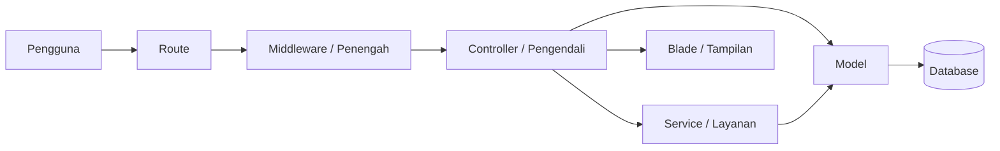

# Arsitektur Sistem

```mermaid
flowchart LR
    U[Pengguna] --> R[Route]
    R --> MW[Middleware / Penengah]
    MW --> C[Controller / Pengendali]
    C --> S[Service / Layanan]
    C --> M[Model]
    S --> M
    M --> DB[(Database)]
    C --> V[Blade / Tampilan]
```
