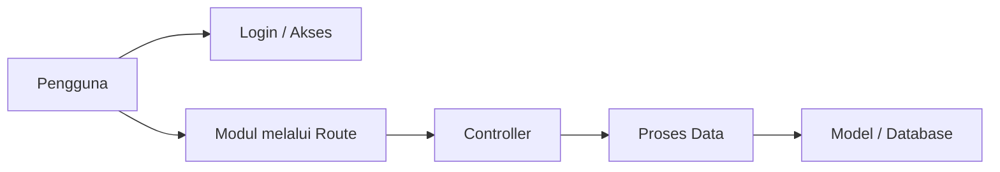

# Use Case Terindikasi

```mermaid
flowchart LR
    A[Pengguna] --> B[Login / Akses]
    A --> C[Modul melalui Route]
    C --> D[Controller]
    D --> E[Proses Data]
    E --> F[Model / Database]
```

Aktor dan use case bisnis final harus divalidasi terhadap kebutuhan sebenarnya.
