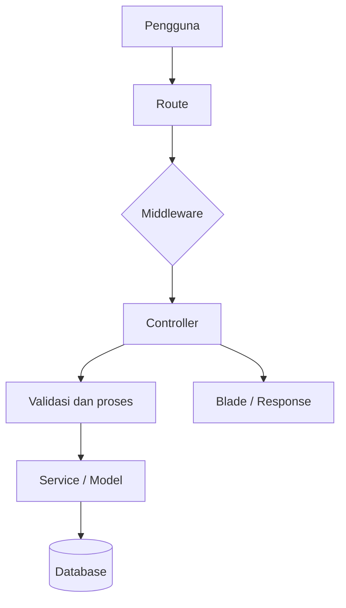

# Workflow Sistem

Jumlah route terdeteksi: **0**

```mermaid
flowchart TD
    A[Pengguna] --> B[Route]
    B --> C{Middleware}
    C --> D[Controller]
    D --> E[Validasi dan proses]
    E --> F[Service / Model]
    F --> G[(Database)]
    D --> H[Blade / Response]
```

## Route terdeteksi

| Metode | Path | File |
|---|---|---|
